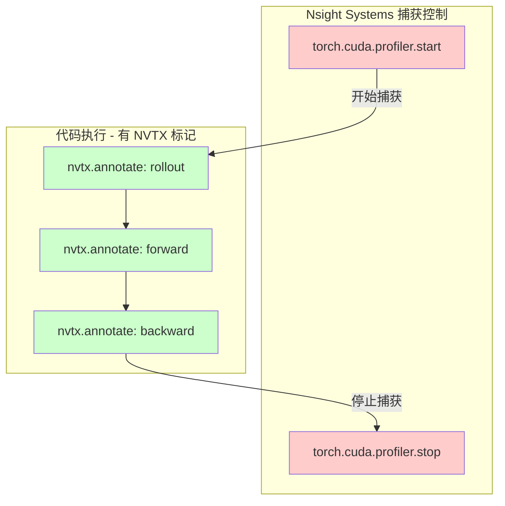
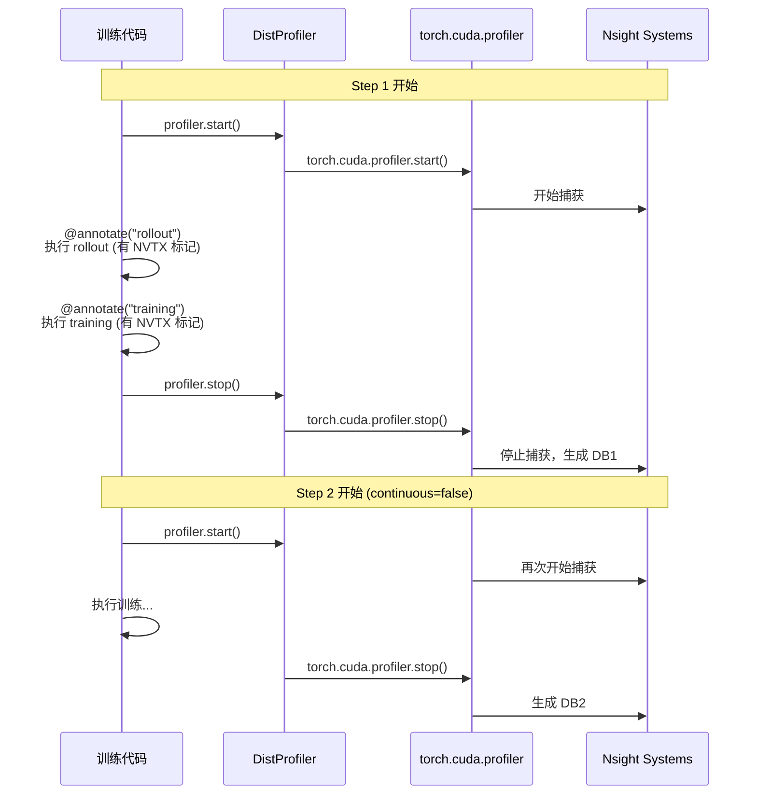

## 1. NVTX 标记 + `torch.cuda.profiler.start/stop` 的组合使用

### verl 的做法

verl **同时使用**了两种机制，它们是**互补**的：



#### 职责分工

| 机制 | 作用 | 对应参数 |
|------|------|----------|
| **`torch.cuda.profiler.start/stop`** | 控制 Nsight Systems **何时开始/停止**捕获数据 | `--capture-range=cudaProfilerApi` |
| **`nvtx.annotate` / `nvtx.start_range`** | 在捕获的数据中**添加可视化标记**，便于分析 | `--trace=nvtx` |

#### 代码示例（verl 风格）

```python
# Worker 中的实现
class NsightSystemsProfiler:
    def start(self, **kwargs):
        if self._this_step:
            torch.cuda.profiler.start()  # 告诉 nsys 开始捕获
    
    def stop(self):
        if self._this_step:
            torch.cuda.profiler.stop()   # 告诉 nsys 停止捕获
    
    def annotate(self, message, domain=None):
        # 在捕获期间添加 NVTX 标记
        return nvtx.annotate(message=message, domain=domain)

# 训练代码中
@DistProfiler.annotate(message="rollout", domain="verl.rollout")
def generate_rollouts(self):
    # ... rollout logic ...
    pass

# 在 training loop 中
profiler.start()  # -> torch.cuda.profiler.start()
generate_rollouts()  # 内部有 nvtx 标记
profiler.stop()   # -> torch.cuda.profiler.stop()
```

### 为什么这样设计？

1. **精确控制捕获范围**：`cudaProfilerApi` 避免捕获不必要的初始化和销毁阶段
2. **可视化分析**：NVTX 标记让你在 Nsight UI 中看到清晰的函数调用层次
3. **低开销**：只在指定的 step 捕获，而 NVTX 标记本身开销极小

---

## 2. `profile_continuous_steps` 的含义

### verl 的 `continuous` 配置

**核心概念**：控制 Nsight Systems 生成**几个 `.nsys-rep` 文件**

### 配置组合

假设 `steps: [1, 2, 5]`：

| `profile_continuous_steps` | `discrete` | 结果 |
|---------------------------|-----------|------|
| `True` | `False` | **2 个文件**：`[1,2]` 合并为 1 个，`[5]` 为 1 个 |
| `False` | `False` | **3 个文件**：`[1]`, `[2]`, `[5]` 各 1 个 |
| `False` | `True` | **3+ 个文件**：每个 step 的每个 role（actor/critic/rollout）都有独立文件 |

### 实现机制

```python
# verl/verl/trainer/ppo/ray_trainer.py (line 1017, 1264)
if self.config.global_profiler.profile_continuous_steps:
    # 连续模式：只在第一个 step 调用 start，最后一个 step 调用 stop
    if current_step == first_step:
        profiler.start()
    if current_step == last_step:
        profiler.stop()
else:
    # 独立模式：每个 step 都 start/stop
    profiler.start()
    # ... training logic ...
    profiler.stop()
```

### 对应的 `capture-range-end` 参数

```yaml
# verl/verl/trainer/config/ppo_trainer.yaml
worker_nsight_options:
  capture-range: "cudaProfilerApi"
  capture-range-end: "repeat-shutdown:n"  # n = len(steps) 或更多
```

- **`repeat-shutdown:n`**：允许 nsys 捕获 n 次 `start/stop` 对
- **`continuous=False`**：n = len(steps)（每个 step 一次）
- **`continuous=True`**：n = 连续段数量（如 [1,2,5] → n=2）

---

## 3. RLinf 应该如何配置？

### 推荐方案（对齐 verl）

#### Driver 进程（`run_embodiment_profiling.sh`）

**选择**：**API 驱动**（`--capture-range=cudaProfilerApi`）

**原因**：
- 与 Worker 保持一致
- 可以精确控制捕获哪些 step
- 避免捕获漫长的初始化过程

**修改**：

```bash
# 移除时间驱动参数
# --delay=${DELAY} --duration=${DURATION}

# 改为 API 驱动
NSYS_OPTS+=" --capture-range=cudaProfilerApi"
NSYS_OPTS+=" --capture-range-end=repeat-shutdown:3"  # 假设 profile 3 个 steps
NSYS_OPTS+=" --kill=none"  # 防止强制终止
```

#### Worker 进程（已实现）

```yaml
# profiling_config.yaml
worker_nsight_options:
  capture-range: "cudaProfilerApi"  # ✅ 已配置
  capture-range-end: null           # 可以设置为 "repeat-shutdown:n"
  kill: "none"                      # ✅ 已配置
```

#### `continuous` 的含义（RLinf）

```yaml
profiling:
  steps: [10, 20, 30]
  continuous: false  # 建议先用 false，每个 step 独立生成 trace
```

- **`continuous: false`**（推荐）：每个 step 独立 start/stop，生成 3 个 `.nsys-rep` 文件
- **`continuous: true`**：从 step 10 start，到 step 30 stop，生成 1 个 `.nsys-rep` 文件

### 需要修改的地方

1. **`run_embodiment_profiling.sh`**：
   - 使用 `--capture-range=cudaProfilerApi` 替代时间驱动
   - 添加 `--capture-range-end=repeat-shutdown:n`（根据 steps 长度计算）
   - 添加 `--kill=none`

2. **`profiling_config.yaml`**：
   - 明确 `continuous` 的语义
   - 为 `controller_nsight_options` 添加 `capture-range` 和 `capture-range-end`

---

## 总结

### verl 的核心设计



### 关键点

1. **`--capture-range=cudaProfilerApi`** 是 **Worker 和 Driver 都应该使用**的模式
2. **NVTX 标记**和 **cudaProfilerApi** 是互补的，不是二选一
3. **`continuous`** 控制是否将多个 step 合并到一个数据库中


为什么@verl/verl/trainer/config/ppo_megatron_trainer.yaml 中controller 也包含nsight选项？
为什么选项和worker相比只有三个？
verl 是否需要profiling的是否需要用nsys启动训练程序？

## 关键差异：架构设计不同

### verl 的架构

## verl vs RLinf 的 Profiling 架构对比

### 1. **verl 的设计**

```python
# verl/verl/trainer/main_ppo.py:93
runner = task_runner_class.options(runtime_env={"nsight": nsight_options}).remote()
```

**关键点**：
- **Controller（TaskRunner）也是一个 Ray Actor**
- **通过 Ray 的 `runtime_env={"nsight": ...}` 自动启动 nsys**
- **不需要用户手动包裹 `nsys profile` 命令**

因此：
- `controller_nsight_options` **只需要基本的 trace 参数**（trace, cuda-memory-usage, cuda-graph-trace）
- **不需要** `capture-range`, `capture-range-end`, `kill` 等控制参数
- Ray 会自动处理进程启动和 nsys 包裹

### 2. **RLinf 的设计**

```python
# rlinf/runners/embodied_runner.py
class EmbodiedRunner:  # 不是 Ray Actor
    def run(self):
        # 直接运行训练循环
        ...
```

**关键点**：
- **Controller（EmbodiedRunner）不是 Ray Actor**，是普通 Python 类
- **需要用户手动用 `nsys profile` 包裹启动脚本**
- **启动脚本**：`examples/embodiment/run_embodiment_profiling.sh`

因此：
- `controller_nsight_options` **需要包含所有 `nsys profile` 的参数**
- **必须包含** `capture-range`, `capture-range-end`, `kill` 等控制参数
- 这些参数直接传递给 `nsys profile` 命令

## 是否需要用 nsys 启动？

### verl：**不需要**

```bash
# verl 的启动方式（无需 nsys 包裹）
python3 -m verl.trainer.main_ppo \
    global_profiler.tool=nsys \
    global_profiler.steps=[1,2,5] \
    ...
```

✅ Ray 内部会自动为 Controller 和 Worker 启动 nsys

### RLinf：**需要**

```bash
# RLinf 的启动方式（必须用 nsys 包裹）
nsys profile \
    --capture-range=cudaProfilerApi \
    --capture-range-end=repeat-shutdown:3 \
    --kill=none \
    ... \
    python train_embodied_agent.py \
        ++runner.profiling_config=profiling_config.yaml
```

✅ Driver 进程需要手动包裹，Worker 通过 Ray 自动启动

## 总结

| 项目 | verl | RLinf |
|------|------|-------|
| **Controller 类型** | Ray Actor | 普通 Python 类 |
| **需要 nsys 包裹？** | ❌ 否（Ray 自动） | ✅ 是（手动脚本） |
| **controller_nsight_options** | 3 个参数（基本 trace） | 8 个参数（完整 nsys 命令） |
| **启动方式** | `python main_ppo.py` | `nsys profile ... python train.py` |

## 建议

您当前的 RLinf 实现是**正确的**，因为：

1. RLinf 的 Controller 不是 Ray Actor，所以**必须**手动用 `nsys profile` 包裹
2. 配置中包含 `capture-range`, `capture-range-end`, `kill` 等参数是**必要的**
3. 这些参数会被 `run_embodiment_profiling.sh` 读取并传递给 `nsys` 命令

如果想像 verl 一样简化配置，需要将 `EmbodiedRunner` 改造为 Ray Actor，但这会是一个**重大的架构变更**，不建议现在进行。