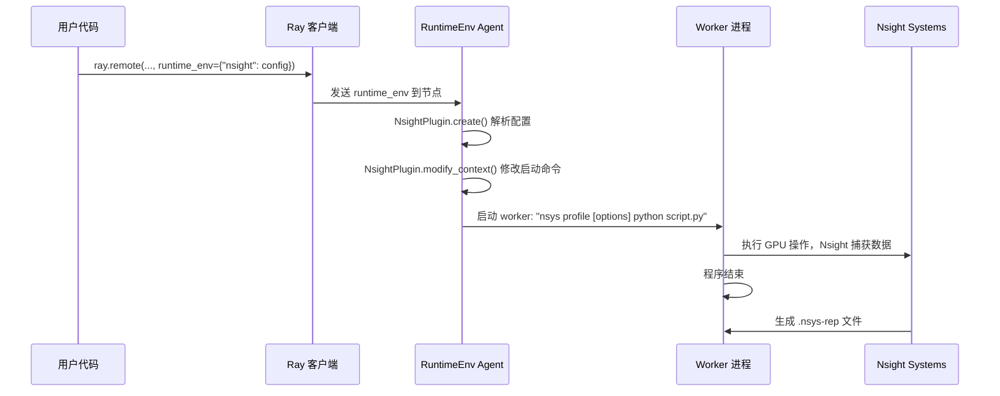

# Ray Nsight System (Nsight) 集成机制详解

本文档详细解析 Ray 如何通过 runtime_env 机制集成 Nsight Systems 进行 GPU profiling，以及完整的调用路径和实现细节。

## 概述

Nsight Systems (nsys) 是 NVIDIA 提供的系统级 GPU profiling 工具，可以捕获 CUDA API 调用、GPU kernel 执行、内存操作等详细性能数据。然而，在分布式系统中（如 Ray），传统的 `nsys profile` 命令无法直接 profiling 远程 worker 进程。

Ray 通过 runtime_env 插件系统巧妙地解决了这个问题：**在 worker 进程启动时自动注入 nsys 前缀命令**。

## 核心机制

### 1. Runtime Environment 插件系统

Ray 的 runtime_env 不仅仅是环境变量，还支持插件机制。Nsight 集成通过 `NsightPlugin` 实现 `RuntimeEnvPlugin` 接口：

```python
# ray/_private/runtime_env/nsight.py
class NsightPlugin(RuntimeEnvPlugin):
    name = "_nsight"

    def create(self, uri, runtime_env, context, logger):
        """处理 nsight 配置，生成 nsys 命令"""
        nsight_config = runtime_env.nsight()
        if nsight_config:
            # 验证配置
            self._check_nsight_script(nsight_config)
            # 转换字典为命令行参数
            self.nsight_cmd = parse_nsight_config(nsight_config)
        return 0

    def modify_context(self, uris, runtime_env, context, logger):
        """关键方法：修改 worker 启动命令"""
        logger.info("Running nsight profiler")
        # 修改 Python 可执行文件路径
        context.py_executable = " ".join(self.nsight_cmd) + " python"
```

### 2. Nsight 配置转换

```python
# ray/_private/runtime_env/nsight.py
def parse_nsight_config(nsight_config: Dict[str, str]) -> List[str]:
    """将字典配置转换为 nsys 命令行参数"""
    nsight_cmd = ["nsys", "profile"]
    for option, option_val in nsight_config.items():
        if len(option) > 1:
            nsight_cmd.append(f"--{option}={option_val}")
        else:
            nsight_cmd += [f"-{option}", option_val]
    return nsight_cmd
```

### 3. 默认配置

```python
# ray/_private/runtime_env/nsight.py
NSIGHT_DEFAULT_CONFIG = {
    "t": "cuda,cudnn,cublas,nvtx",  # 追踪 CUDA, cuDNN, cuBLAS, NVTX
    "o": "'worker_process_%p'",     # 输出文件名 (包含进程ID)
    "stop-on-exit": "true",         # 程序退出时停止 profiling
}
```

## 调用流程



### 详细步骤

1. **配置传递**
   ```python
   # 用户代码
   @ray.remote(runtime_env={"nsight": {"trace": "cuda,nvtx"}})
   class MyActor:
       pass
   ```

2. **插件处理**
   - Ray 检测 `runtime_env` 包含 `"nsight"` 键
   - 加载 `NsightPlugin`
   - 调用 `plugin.create()` 验证和转换配置

3. **上下文修改**
   - `plugin.modify_context()` 被调用
   - `context.py_executable` 被修改为: `"nsys profile --trace=cuda,nvtx python"`

4. **Worker 启动**
   - Ray 通过 `subprocess` 或类似机制启动 worker
   - 实际执行命令: `nsys profile --trace=cuda,nvtx python worker_script.py`

5. **Profiling 执行**
   - Worker 中的 CUDA/NVTX 代码被 nsys 捕获
   - 程序结束时生成 `.nsys-rep` 文件

## 关键文件

### ray/_private/runtime_env/nsight.py

```python
import asyncio
import copy
import logging
import os
import subprocess
import sys
from pathlib import Path
from typing import Dict, List, Optional, Tuple

# 默认配置
NSIGHT_DEFAULT_CONFIG = {
    "t": "cuda,cudnn,cublas,nvtx",
    "o": "'worker_process_%p'",
    "stop-on-exit": "true",
}

def parse_nsight_config(nsight_config: Dict[str, str]) -> List[str]:
    """转换配置为命令行参数"""
    nsight_cmd = ["nsys", "profile"]
    for option, option_val in nsight_config.items():
        if len(option) > 1:
            nsight_cmd.append(f"--{option}={option_val}")
        else:
            nsight_cmd += [f"-{option}", option_val]
    return nsight_cmd

class NsightPlugin(RuntimeEnvPlugin):
    name = "_nsight"

    def __init__(self, resources_dir: str):
        self.nsight_cmd = []
        # 日志目录: /tmp/ray/session_*/logs/nsight/
        session_dir, runtime_dir = os.path.split(resources_dir)
        self._nsight_dir = Path(session_dir) / "logs" / "nsight"
        try_to_create_directory(self._nsight_dir)

    async def _check_nsight_script(self, nsight_config: Dict[str, str]) -> Tuple[bool, str]:
        """验证 nsys 配置是否有效"""
        # 创建测试配置
        nsight_config_copy = copy.deepcopy(nsight_config)
        nsight_config_copy["o"] = str(Path(self._nsight_dir) / "empty")

        nsight_cmd = parse_nsight_config(nsight_config_copy)
        try:
            # 执行测试命令: nsys profile [options] python -c ""
            nsight_cmd = nsight_cmd + [sys.executable, "-c", '""']
            process = await asyncio.create_subprocess_exec(
                *nsight_cmd,
                stdout=subprocess.PIPE,
                stderr=subprocess.PIPE,
            )
            stdout, stderr = await process.communicate()

            # 清理测试文件
            clean_up_cmd = ["rm", f"{nsight_config_copy['o']}.nsys-rep"]
            cleanup_process = await asyncio.create_subprocess_exec(
                *clean_up_cmd,
                stdout=subprocess.PIPE,
                stderr=subprocess.PIPE,
            )
            await cleanup_process.communicate()

            return process.returncode == 0, stderr.strip() or stdout.strip()
        except FileNotFoundError:
            return False, "nsight is not installed"

    async def create(self, uri, runtime_env, context, logger, **kwargs):
        """创建 runtime_env"""
        nsight_config = runtime_env.nsight()
        if not nsight_config:
            return 0

        # 仅支持 Linux
        if sys.platform != "linux":
            raise RuntimeEnvSetupError("Nsight CLI is only available in Linux.")

        # 处理默认配置
        if isinstance(nsight_config, str):
            if nsight_config == "default":
                nsight_config = NSIGHT_DEFAULT_CONFIG
            else:
                raise RuntimeEnvSetupError(
                    f"Unsupported nsight config: {nsight_config}. "
                    "The supported config is 'default' or Dict of nsight options"
                )

        # 验证配置
        is_valid_nsight_cmd, error_msg = await self._check_nsight_script(nsight_config)
        if not is_valid_nsight_cmd:
            logger.warning(error_msg)
            raise RuntimeEnvSetupError(
                f"nsight profile failed to run with error: {error_msg}"
            )

        # 设置输出路径到 logs 目录
        nsight_config["o"] = str(
            Path(self._nsight_dir) / nsight_config.get("o", NSIGHT_DEFAULT_CONFIG["o"])
        )
        self.nsight_cmd = parse_nsight_config(nsight_config)
        return 0

    def modify_context(self, uris, runtime_env, context, logger, **kwargs):
        """修改 worker 启动上下文"""
        logger.info("Running nsight profiler")
        # 关键：修改 Python 可执行文件路径
        # 原来的: "python"
        # 修改为: "nsys profile --trace=cuda,nvtx python"
        context.py_executable = " ".join(self.nsight_cmd) + " python"
```

### ray/_private/runtime_env/plugin.py

```python
class RuntimeEnvPlugin(ABC):
    """Runtime Environment 插件基类"""

    name: str = None

    @abstractmethod
    async def create(self, uri, runtime_env, context, logger, **kwargs):
        """创建和安装 runtime environment"""
        pass

    def modify_context(self, uris, runtime_env, context, logger, **kwargs):
        """修改 worker 启动行为"""
        pass
```

## 使用示例

### 基本用法

```python
import ray

# 使用默认配置
@ray.remote(num_gpus=1, runtime_env={"nsight": "default"})
class MyActor:
    def run(self):
        # CUDA 代码会被 nsys 捕获
        pass

# 自定义配置
@ray.remote(num_gpus=1, runtime_env={
    "nsight": {
        "trace": "cuda,nvtx,osrt",
        "cuda-memory-usage": "true",
        "output": "my_profile"
    }
})
class MyActor:
    def run(self):
        pass
```

### RLinf 中的使用

```python
# rlinf/config/profiling_config.yaml
profiling:
  nsight:
    worker_nsight_options:
      trace: "cuda,nvtx,osrt,vulkan,cudnn,cublas,ucx"
      cuda-memory-usage: "true"
      cuda-graph-trace: "graph"
      capture-range: "cudaProfilerApi"
      kill: "none"

# rlinf/scheduler/cluster/cluster.py
def allocate(self, ..., nsight_options: dict = None):
    runtime_env = {
        "py_executable": python_interpreter_path,
        "env_vars": merged_env_vars,
    }
    if nsight_options is not None:
        runtime_env["nsight"] = nsight_options  # 传递给 Ray
```

## 架构优势

### 1. 透明集成
- 用户无需修改 worker 代码
- 自动处理分布式环境中的 profiling

### 2. 配置灵活
- 支持默认配置和自定义配置
- 可以在运行时动态调整 profiling 参数

### 3. 资源隔离
- 每个 worker 独立 profiling
- 输出文件自动区分（包含进程ID）

### 4. 错误处理
- 预先验证 nsys 配置
- 提供详细的错误信息

## 故障排除

### 常见问题

1. **"nsight is not installed"**
   - 解决方案：安装 Nsight Systems CLI
   ```bash
   # Ubuntu/Debian
   sudo apt install nsight-systems-cli

   # 或从 NVIDIA 官网下载
   ```

2. **权限错误**
   - 解决方案：在 Docker 中需要适当权限
   ```dockerfile
   RUN apt-get update && apt-get install -y nsight-systems-cli
   ```

3. **输出文件找不到**
   - 检查 Ray logs 目录：`/tmp/ray/session_*/logs/nsight/`

4. **配置无效**
   - 使用 `nsys profile --help` 查看支持的选项
   - 验证配置字典格式

## 总结

Ray 通过 runtime_env 插件系统实现了对 Nsight Systems 的深度集成：

1. **插件机制**：`NsightPlugin` 继承 `RuntimeEnvPlugin`
2. **配置转换**：字典配置 → nsys 命令行参数
3. **上下文修改**：`modify_context()` 修改 `py_executable`
4. **自动注入**：worker 启动时自动添加 nsys 前缀

这种设计使得分布式 GPU profiling 变得透明和易用，用户只需要在 `runtime_env` 中指定 nsight 配置即可。

